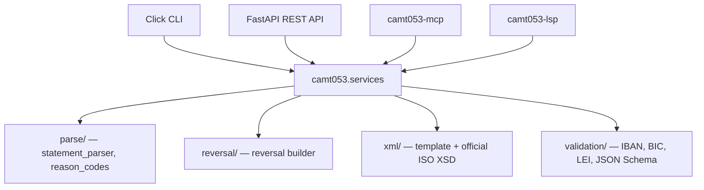

# camt053: ISO 20022 Bank Statements and Reversing Entries

<p align="center">
  
</p>

[![PyPI Version][pypi-badge]][07]
[![Python Versions][python-versions-badge]][07]
[![License][license-badge]][01]
[![Tests][tests-badge]][tests-url]
[![Quality][quality-badge]][quality-url]
[![Documentation][docs-badge]][docs-url]

**Read ISO 20022 `camt` Bank-to-Customer Cash Management messages, extract
booked entries by return reason code (e.g. AC04 Closed Account), and generate
validated reversing entries** — the core of a modern, AI-assisted treasury
stack with native MCP and LSP integrations.

> **Latest release: v0.0.1** — namespace-agnostic camt.052/053/054 parsing and
> one-shot reversing-entry generation, validated against the official ISO 20022
> `camt.053.001.14` schema, for Python 3.10+.
> [See what's new →][release-001]

## Contents

- [Overview](#overview)
- [Install](#install)
- [Quick Start](#quick-start)
- [Features](#features)
- [Usage](#usage)
- [Supported messages](#supported-messages)
- [Architecture](#architecture)
- [Examples](#examples)
- [Development](#development)
- [License](#license)
- [Contributing](#contributing)
- [Acknowledgements](#acknowledgements)

## Overview

**camt053** reads ISO 20022 `camt` cash-management messages — the standardised
bank-to-customer **statements** (camt.053), **account reports** (camt.052), and
**debit/credit notifications** (camt.054) — into a typed model, lets you filter
booked entries by ISO external return reason code, and generates a **validated
reversing entry** for the matching transactions.

The headline capability is the one-shot reversing-entry workflow: read an
incoming camt.053 statement, find the entries carrying a return reason code
(e.g. **AC04 Closed Account**), and emit a validated reversing entry — answering
the prompt-engineering dream:

> *"Read this incoming bank statement XML, parse out the transactions with error
> code AC04, and automatically generate the reversing entry."*

- **Website:** <https://camt053.com>
- **Source code:** <https://github.com/sebastienrousseau/camt053>
- **Bug reports:** <https://github.com/sebastienrousseau/camt053/issues>

A single shared facade (`camt053.services`) backs four developer surfaces — the
Python API, the CLI, the REST API, and the companion MCP and LSP servers — so
every interface behaves identically. This package is part of the **camt053
suite** (all Python 3.10+):

| Package | Role |
|---------|------|
| `camt053` | Core library + Click CLI + FastAPI REST API (this package) |
| [`camt053-mcp`][mcp-pkg] | Model Context Protocol server (for AI agents) |
| [`camt053-lsp`][lsp-pkg] | Language Server Protocol server (for editors) |


## Install

**camt053** runs on macOS, Linux, and Windows and requires **Python 3.10+** and
**pip**.

```sh
python -m pip install camt053
```

<details>
<summary>Using an isolated virtual environment (recommended)</summary>

```sh
python -m venv venv
source venv/bin/activate        # macOS/Linux
venv\Scripts\activate           # Windows
python -m pip install -U camt053
```
</details>

## Quick Start

```python
from camt053 import services

# An incoming camt.053 statement (truncated for brevity — see examples/).
statement_xml = open("statement.xml", encoding="utf-8").read()

# Find the entries returned AC04 (Closed Account).
ac04 = services.filter_entries(statement_xml, "AC04")
print(f"{len(ac04)} AC04 entr{'y' if len(ac04) == 1 else 'ies'}")

# Generate the reversing entry: parse -> filter -> reverse, in one call.
reversal_xml = services.generate_reversal(statement_xml, reason_code="AC04")
print(reversal_xml)  # validated camt.053.001.14 document
```

Or from the command line:

```sh
# Generate a reversing entry for every AC04 entry on a statement
camt053 reverse -i statement.xml -r AC04 -o reversal.xml

# List the entries on a statement (filter by reason, status, date, or amount)
camt053 entries -i statement.xml -r AC04
camt053 entries -i statement.xml --status BOOK --from 2026-06-01 --min 1000

# Export the (filtered) entries as CSV or JSON, to stdout or a file
camt053 entries -i statement.xml --export csv -o entries.csv
camt053 entries -i statement.xml -r AC04 --export json

# Inspect the parsed statement as JSON, or validate an identifier
camt053 parse -i statement.xml
camt053 validate-id -k iban -v GB29NWBK60161331926819

# Validate an incoming statement against its official ISO camt XSD
camt053 validate -i statement.xml
```

`parse`, `entries`, `reverse`, and `validate` accept `-i -` to read from stdin,
so they compose in a pipeline.

## Features

- **Parse** camt.053 / camt.052 / camt.054 into a typed, JSON-serialisable
  model. Parsing is **namespace-agnostic**, so every ISO version (`.001.01`
  through `.001.14`) and real-world bank file is read.
- **Filter** booked entries by ISO external return reason code (AC04, AC06,
  MD07, …), and by **status**, **booking-date range**, and **amount range**
  (all ANDed) via `services.filter_entries(...)` or the `camt053 entries`
  flags.
- **Return reason codes** — a substantial slice of the ISO 20022
  `ExternalReturnReason1Code` set (the common SEPA / CBPR+ return reasons),
  listed via `camt053 reasons`, with case-insensitive lookup through
  `services.validate_reason_code(code) -> {"code", "name", "valid"}`.
- **Export** the (filtered) entries to **CSV** or **JSON** (`camt053 entries
  --export {csv,json} [-o file]`); CSV columns are `reference, amount,
  currency, credit_debit_indicator, status, booking_date, value_date,
  reason_code`.
- **Reverse** — generate a `camt.053.001.14` reversing entry from the matching
  entries (credit/debit indicator flipped, `RvslInd` set, return reason carried
  in `RtrInf`), in one call.
- **Validated output** — generated reversals are checked against the **official
  ISO 20022 `camt.053.001.14` XSD** bundled with the package.
- **Validate incoming statements** — `services.validate_statement(xml)` (and the
  `camt053 validate` command) check an inbound camt.052 / camt.053 / camt.054
  document against the matching **official ISO 20022 XSD**, detected from its
  namespace, returning `{"valid", "message_type", "errors"}`.
- **Safe by default** — XML is parsed with `defusedxml` (XXE / billion-laughs
  safe); output paths are traversal-checked.
- **One facade, four interfaces** — the CLI, REST API, MCP server, and LSP
  server all call `camt053.services`.
- **IBAN / BIC / LEI validators** (ISO 13616 / 9362 / 17442).
- **Decimal amounts & ISO 4217 currencies** — `Entry.amount_decimal` /
  `Balance.amount_decimal` parse the string amount into a `Decimal` (the
  string is kept verbatim for XML fidelity), and
  `services.validate_currency(code) -> {"code", "valid", "minor_units"}`
  checks a code against a bundled ISO 4217 set and reports its minor units
  (EUR=2, JPY=0, …).
- **Typed** (mypy `--strict`) and **tested** (100% coverage), validated against
  the official ISO 20022 business samples.

## Usage

```python
from camt053 import parse_statement, services

# A minimal incoming camt.053 statement: a EUR 1,500 credit transfer that was
# booked, then returned because the beneficiary account was closed (AC04).
statement_xml = """<?xml version="1.0" encoding="UTF-8"?>
<Document xmlns="urn:iso:std:iso:20022:tech:xsd:camt.053.001.14">
  <BkToCstmrStmt>
    <GrpHdr><MsgId>STMT-MSG-0001</MsgId><CreDtTm>2026-06-15T08:00:00</CreDtTm></GrpHdr>
    <Stmt>
      <Id>STMT-0001</Id><CreDtTm>2026-06-15T08:00:00</CreDtTm>
      <Acct><Id><IBAN>GB29NWBK60161331926819</IBAN></Id><Ccy>EUR</Ccy></Acct>
      <Bal><Tp><CdOrPrtry><Cd>CLBD</Cd></CdOrPrtry></Tp>
        <Amt Ccy="EUR">10000.00</Amt><CdtDbtInd>CRDT</CdtDbtInd>
        <Dt><Dt>2026-06-15</Dt></Dt></Bal>
      <Ntry>
        <NtryRef>NTRY-0001</NtryRef>
        <Amt Ccy="EUR">1500.00</Amt><CdtDbtInd>CRDT</CdtDbtInd>
        <Sts><Cd>BOOK</Cd></Sts>
        <NtryDtls><TxDtls>
          <RtrInf><Rsn><Cd>AC04</Cd></Rsn></RtrInf>
        </TxDtls></NtryDtls>
      </Ntry>
    </Stmt>
  </BkToCstmrStmt>
</Document>"""

# 1. Parse into the typed model.
statement = parse_statement(statement_xml)
print(statement.account.identifier())          # -> GB29NWBK60161331926819
print(len(statement.entries))                   # -> 1

# 2. Select the entries returned AC04 (Closed Account).
ac04 = statement.entries_with_reason("AC04")
print(ac04[0].amount, ac04[0].credit_debit_indicator)   # -> 1500.00 CRDT

# 3. Generate the validated reversing entry (the original CRDT becomes DBIT).
reversal_xml = services.generate_reversal(statement_xml, reason_code="AC04")
assert "<RvslInd>true</RvslInd>" in reversal_xml
assert "<CdtDbtInd>DBIT</CdtDbtInd>" in reversal_xml
```

## Supported messages

| Message type | Name | Direction |
|--------------|------|-----------|
| `camt.052.001.14` | Bank To Customer Account Report | read |
| `camt.053.001.14` | Bank To Customer Statement | read + **reverse** |
| `camt.054.001.14` | Bank To Customer Debit Credit Notification | read |

The parser is namespace-agnostic and reads every ISO version of these messages;
the official XSDs for `.001.01`–`.001.14` are bundled under `camt053/xsd/`.
Reversing entries are emitted as `camt.053.001.14`.

## Architecture



| Module | Responsibility |
|--------|----------------|
| `camt053.parse` | Namespace-agnostic statement parser and return-reason helpers |
| `camt053.reversal` | Builds flat reversing-entry records from parsed entries |
| `camt053.xml` | Renders the camt.053 reversal template and validates it via the ISO XSD |
| `camt053.validation` | IBAN / BIC / LEI and JSON-Schema validators |
| `camt053.security` | XXE-safe parsing and path-traversal-checked output |
| `camt053.services` | The shared facade backing every interface |

## Error handling

Every exception in [`camt053.exceptions`](camt053/exceptions.py) inherits from
`Camt053Error` and carries a stable, machine-readable `code`. These codes are
part of the public API — they are guaranteed unique and will not change across
releases — so you can switch on `exc.code` (e.g. to map a failure onto an HTTP
status) without depending on the class name or message text.

| Code | Exception | Meaning |
|------|-----------|---------|
| `CAMT053_ERROR` | `Camt053Error` | Base error for any Camt053 failure |
| `ACCOUNT_VALIDATION_ERROR` | `AccountValidationError` | Account/input data failed validation |
| `XML_GENERATION_ERROR` | `XMLGenerationError` | XML rendering or template failure |
| `CONFIGURATION_ERROR` | `ConfigurationError` | Invalid configuration or CLI arguments |
| `DATA_SOURCE_ERROR` | `DataSourceError` | A data source could not be read |
| `SCHEMA_VALIDATION_ERROR` | `SchemaValidationError` | XML did not conform to its ISO 20022 XSD |
| `INVALID_IBAN_ERROR` | `InvalidIBANError` | IBAN format / checksum validation failed |
| `INVALID_BIC_ERROR` | `InvalidBICError` | BIC/SWIFT format validation failed |
| `INVALID_LEI_ERROR` | `InvalidLEIError` | LEI format / checksum validation failed |
| `MISSING_REQUIRED_FIELD_ERROR` | `MissingRequiredFieldError` | A required field was absent |
| `STATEMENT_PARSE_ERROR` | `StatementParseError` | An incoming statement could not be parsed |
| `REVERSAL_GENERATION_ERROR` | `ReversalGenerationError` | A reversing entry could not be generated |

```python
from camt053 import services
from camt053.exceptions import Camt053Error

try:
    services.generate_reversal(statement_xml, reason_code="AC04")
except Camt053Error as exc:
    log.error("[%s] %s", exc.code, exc)
```

## Examples

Runnable, self-contained scripts live in [`examples/`](examples/):

| Example | Demonstrates |
|---------|--------------|
| [`reverse_ac04.py`](examples/reverse_ac04.py) | The headline workflow — find AC04 entries and generate the reversing entry |
| [`parse_statement.py`](examples/parse_statement.py) | Parsing a statement into the typed model |
| [`services_facade.py`](examples/services_facade.py) | The shared `camt053.services` facade |
| [`validate_identifiers.py`](examples/validate_identifiers.py) | IBAN / BIC / LEI validation |
| [`rest_api_client.py`](examples/rest_api_client.py) | Driving the FastAPI REST API in-process |

```sh
git clone https://github.com/sebastienrousseau/camt053.git && cd camt053
python examples/reverse_ac04.py
```

## Development

**camt053** uses [Poetry](https://python-poetry.org/) and
[mise](https://mise.jdx.dev/).

```bash
git clone https://github.com/sebastienrousseau/camt053.git && cd camt053
mise install
poetry install
poetry shell
```

A `Makefile` orchestrates the quality gates (kept in lockstep with CI):

```bash
make check        # all gates (REQUIRED before commit)
make test         # pytest with coverage (100% gate)
make lint         # ruff + black --check
make type-check   # mypy --strict
make examples     # run the example scripts
```

## License

Licensed under the [Apache License, Version 2.0][01]. Any contribution submitted
for inclusion shall be licensed as above, without additional terms.

## Contributing

Contributions are welcome — see the [contributing instructions][04]. Thanks to
all [contributors][05].

## Acknowledgements

Built on [Click](https://click.palletsprojects.com/),
[Rich](https://rich.readthedocs.io/), [Jinja2](https://jinja.palletsprojects.com/),
[xmlschema](https://github.com/sissaschool/xmlschema),
[defusedxml](https://github.com/tiran/defusedxml), and
[FastAPI](https://fastapi.tiangolo.com/), against the official ISO 20022
`camt.05x` schemas.

[01]: https://opensource.org/license/apache-2-0/
[04]: https://github.com/sebastienrousseau/camt053/blob/main/CONTRIBUTING.md
[05]: https://github.com/sebastienrousseau/camt053/graphs/contributors
[07]: https://pypi.org/project/camt053/
[mcp-pkg]: https://github.com/sebastienrousseau/camt053-mcp
[lsp-pkg]: https://github.com/sebastienrousseau/camt053-lsp
[release-001]: https://github.com/sebastienrousseau/camt053/releases/tag/v0.0.1
[docs-badge]: https://img.shields.io/badge/Docs-camt053.com-blue?style=for-the-badge
[docs-url]: https://camt053.com/
[license-badge]: https://img.shields.io/pypi/l/camt053?style=for-the-badge
[pypi-badge]: https://img.shields.io/pypi/v/camt053?style=for-the-badge
[python-versions-badge]: https://img.shields.io/pypi/pyversions/camt053.svg?style=for-the-badge
[quality-badge]: https://img.shields.io/github/actions/workflow/status/sebastienrousseau/camt053/ci.yml?branch=main&label=Quality&style=for-the-badge
[quality-url]: https://github.com/sebastienrousseau/camt053/actions/workflows/ci.yml
[tests-badge]: https://img.shields.io/github/actions/workflow/status/sebastienrousseau/camt053/ci.yml?branch=main&label=Tests&style=for-the-badge
[tests-url]: https://github.com/sebastienrousseau/camt053/actions/workflows/ci.yml
